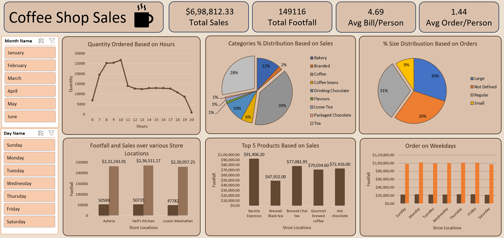

# ☕ Coffee Shop Sales Analysis | Excel Dashboard Project

<div align="center">


### Transforming raw coffee shop transactions into actionable business intelligence
**149,116 Footfall · $6,98,812 Revenue · 3 Store Locations · 6 Business Questions Answered**

[📊 Dashboard](#-dashboard) • [🧹 Power Query](#-power-query--data-cleaning) • [📋 Business Questions](#-business-questions--answers) • [💡 Insights](#-key-insights--recommendations)

</div>

---

## 📌 About This Project

**Coffee Shop Sales** is a multi-location café business generating daily transactional data across three New York store locations — Astoria, Hell's Kitchen, and Lower Manhattan.

This is a complete end-to-end analytics project where I:
- Ingested **raw sales data** into Excel via **Power Query**
- Cleaned and transformed data — removed nulls, fixed data types, extracted time-based columns
- Built **Pivot Tables** to summarize sales, footfall, and product performance
- Designed an **interactive Excel dashboard** with slicers and pivot charts
- Derived **5 actionable business recommendations** from the analysis

> This project simulates a real analyst workflow — from messy raw data to a boardroom-ready dashboard — using **Microsoft Excel only**.

---

## 📊 Dashboard



### Dashboard Features
- **4 KPI cards** — Total Sales, Total Footfall, Avg Bill/Person, Avg Order/Person
- **6 interactive charts** — Quantity by Hour, Category Distribution, Size Distribution, Store Footfall & Sales, Top 5 Products, Orders by Weekday
- **2 slicers** — Filter by Month Name, Day Name
- **Real-time cross-filtering** — clicking any slicer filters the entire dashboard

---

## 🧹 Power Query — Data Cleaning

All data cleaning was done inside Power Query before loading into pivot tables. Applied steps on the sales query:

| Step | What I Did |
|---|---|
| **Source** | Imported raw sales CSV/Excel file |
| **Promoted Headers** | Set first row as column headers |
| **Changed Type** | Assigned correct data types (Date, Time, Text, Number, Currency) |
| **Removed Nulls** | Filtered out blank/null rows from key columns |
| **Extracted Hour** | Extracted hour from `transaction_time` → new column `Hour` |
| **Inserted Month Name** | Extracted month name from `transaction_date` → new column `Month_Name` |
| **Inserted Day Name** | Extracted day name from `transaction_date` → new column `Day_Name` |
| **Added Custom Column** | Calculated `Revenue` = `unit_price` × `transaction_qty` |

> **Result:** A clean, fully enriched sales table — ready for pivot analysis.

---

## 📋 Business Questions & Answers

| # | Question | Answer |
|---|---|---|
| 1 | Total Revenue | $6,98,812.33 |
| 2 | Total Footfall | 1,49,116 customers |
| 3 | Average Bill per Person | $4.69 |
| 4 | Peak Sales Hour | 9–10 AM (morning rush) |
| 5 | Top Product by Revenue | Barista Espresso → $91,406.20 |
| 6 | Best Performing Store | Hell's Kitchen → $2,36,511.17 |
| 7 | Top Sales Category | Coffee → 39% of total sales |
| 8 | Busiest Day of the Week | Monday & Tuesday (highest sales) |
| 9 | Most Popular Order Size | Regular & Large (30% each) |
| 10 | Lowest Traffic Day | Saturday (lowest footfall) |

---

## 💡 Key Insights & Recommendations

**1. ⏰ Staff up between 8–10 AM for the morning rush**
Order quantity peaks sharply between 9–10 AM across all locations. Scheduling additional staff during this window will reduce wait times and improve customer experience during the highest-revenue period.

**2. ☕ Double down on Coffee & Tea promotions**
Coffee (39%) and Tea (28%) together account for 67% of all sales. Targeted combo deals or loyalty rewards on these two categories will drive repeat visits and increase average order value.

**3. 🏪 Investigate Lower Manhattan's lower revenue**
Despite similar footfall (~47,782), Lower Manhattan generates slightly less revenue ($2,30,057) compared to the other two stores. A product mix or pricing audit could help close the gap.

**4. 🌙 Run off-peak promotions in the afternoon**
Order volume drops sharply after 11 AM and remains low through the afternoon. Flash deals or happy-hour discounts between 2–4 PM could redistribute footfall and boost revenue in dead hours.

**5. 📅 Push weekend-specific campaigns to lift Saturday traffic**
Saturday consistently shows the lowest orders across all weekdays. Weekend bundle offers or social media promotions can attract leisure customers and turn Saturday into a stronger revenue day.

---

## 📁 Repository Structure

```
coffee-shop-sales-analysis/
│
├── 📄 README.md                  ← Project overview (this file)
├── 🖼️ dashboard.png              ← Final Excel dashboard screenshot
├── 📋 coffee_shop_problem_statement.pdf  ← Original business brief
│
└── 📂 dataset/
    └── coffee_shop_sales.xlsx    ← Raw transactional sales data
```

---

## 🚀 How to Reproduce

```
1. Download the dataset from the dataset/ folder
2. Open Microsoft Excel (2016 or later)
3. Go to Data → Get Data → From File → load the sales file via Power Query
4. Apply the cleaning steps listed in the Power Query section above
5. Load the cleaned data into the Excel Data Model
6. Create Pivot Tables for each KPI and chart
7. Build Pivot Charts + add Slicers for Month Name and Day Name
8. Arrange everything on a Dashboard sheet
```

---

## 👤 Author

### Sankineni Raju
**Aspiring Data Analyst** · Excel · Power Query · Power Pivot · SQL · Power BI · Python

I'm a fresher passionate about transforming raw data into decisions that matter. This project demonstrates my ability to independently handle a complete analytics pipeline — data cleaning, transformation, pivot analysis, visualization, and business storytelling — entirely within Microsoft Excel.

<div>

📧 [sankineniraj@gmail.com](mailto:sankineniraj@gmail.com)
&nbsp;|&nbsp;
🔗 [linkedin.com/in/raj-sankineni](https://www.linkedin.com/in/raj-sankineni)
&nbsp;|&nbsp;
🐙 [github.com/SankineniRaj](https://github.com/SankineniRaj)

</div>

---

## 📄 License

This project is built for educational and portfolio purposes.
Dataset used under the Coffee Shop Sales Analysis case study.

---

<div align="center">
⭐ If this project helped you, consider giving it a star — it helps others find it too!
</div>
